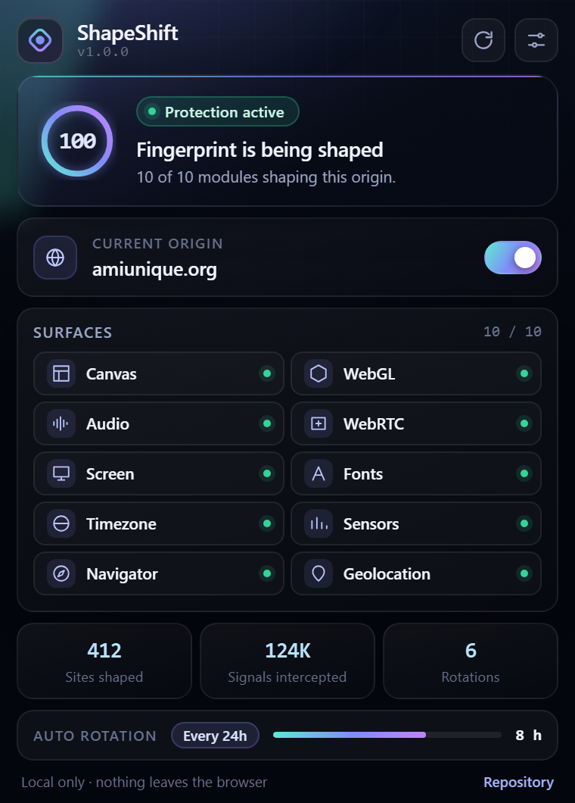

# ShapeShift

<p></p>



**ShapeShift** gives every website a different, stable device fingerprint. It is a Manifest V3 Chromium extension that applies deterministic, per-origin noise to the APIs fingerprinters read — Canvas, WebGL, Audio, WebRTC, Fonts, Screen, Navigator, Timezone, Sensors, Touch, Media, Geolocation and Detection surfaces.

Built from the ground up with a premium control-room interface: deep-space glass, aurora accents, and a live surface map.

- Repository: `git@github.com:dinhdidaudo/shapeshift.git`
- Author: **Phạm Văn Định**
- License: MIT
- Privacy policy: [PRIVACY.md](PRIVACY.md) · Security policy: [SECURITY.md](SECURITY.md)

## Highlights

- **Deterministic by design** — one persistent salt plus the page origin seeds a Xoshiro128** PRNG, so the same site always sees the same spoofed values until you rotate.
- **Per-origin identities** — each origin gets its own noise profile; a tracker cannot correlate two sites.
- **Offline and silent** — no network calls, no telemetry, nothing leaves the browser.
- **Reversible hooks** — every patch is tracked and non-enumerable, so pages cannot detect the wrapper.

## Protected surfaces

| API | Protection method |
|-----|-------------------|
| Canvas | Pixel-level Gaussian noise, including `OffscreenCanvas` |
| WebGL | Parameter jittering, vendor masking, extension shuffling |
| WebGPU | `GPUAdapter.info` reports the same GPU persona WebGL reports |
| Audio | `AudioBuffer` sample noise and `AnalyserNode` frequency noise |
| Fonts | Measurement randomization and `FontFaceSet.check` permutation |
| Screen | Resolution spoofing plus `availLeft` / `availTop` / color depth |
| Navigator | Hardware concurrency, memory, plugins and mime types |
| Timezone | IANA zone switching with identical UTC offset |
| WebRTC | Tri-state policy (`block-host-srflx` / `relay-only` / `off`), candidate filtering, device enumeration masking |
| Sensors | Battery, network and `KeyboardEvent.getModifierState` shaping |
| Touch | Contact geometry jitter |
| Media | Device enumeration masking, `MediaSource` / `MediaRecorder` codec upgrade-only |
| Geolocation | Coarse coordinate perturbation |
| Keyboard | `navigator.keyboard.getLayoutMap()` reports a layout that matches the UA persona |
| Viewport | `visualViewport` accessors re-asserted on the prototype, real values preserved |
| Detection | Headless signal suppression, storage quota normalization, `document.hidden` / `visibilityState` ownership, `Function.prototype.toString` guard |

## Installation

1. **Clone the repository**

   ```bash
   git clone git@github.com:dinhdidaudo/shapeshift.git
   cd shapeshift
   ```

2. **Load it in Chrome**

   - Open `chrome://extensions/`
   - Enable **Developer mode**
   - Click **Load unpacked** and select the repository root

3. **Confirm it is running**

   - Visit `https://amiunique.org/fingerprint`
   - Open DevTools and look for `[shapeshift][page] All hooks installed successfully`
   - Toggle the popup switch off and reload — the page must see its real values again

## Using ShapeShift

### Popup

- Per-site protection switch (whitelist trusted sites)
- **Generate new identity** — rotate the salt immediately
- Live readout of active surfaces and intercepted reads

### Settings — the control room

| Panel | What it controls |
|-------|------------------|
| Overview | Protection score, surface counters, one-click presets |
| Surfaces | Rendering, audio and font hooks |
| Network & media | WebRTC, media devices, geolocation |
| Identity | Salt rotation, per-origin fingerprints, auto-rotation schedule |
| Sites | Per-origin enable/pause list |
| Advanced | Noise strength, KDF strength, debug logging |
| About | Version, repository, license |

### Presets

- **Light** — minimal noise for fragile applications
- **Balanced** — everyday privacy, nothing breaks
- **Maximum** — maximum divergence, some sites may misbehave

## How it works

ShapeShift runs in two worlds:

1. **ISOLATED world** — content scripts load configuration from storage, derive the seed and compute spoofed values.
2. **MAIN world** — `page_world_injector.js` applies the patches to the APIs the page actually reads.

Every hook registers on `globalThis.ssHookInstallers`, guards itself with `ssStealth`, and derives its values from the seeded PRNG:

```
seed = KDF(persistent salt, page origin)
value = PRNG(seed, surface, call index)
```

Because the same inputs always produce the same outputs, a site sees a stable device — and a different device on every other origin.

## Storage contract

| Key | Shape | Owner |
|---|---|---|
| `ssConfig` | flat config object | options page |
| `ss_salt` | hex string | `core/salts.js` |
| `ss_stats` | counters such as `totalCanvasReads` | stats tracker / service worker |
| `ss_site_settings` | `{ "<origin>": { enabled: boolean } }` | popup + options |
| `ss_rotation_info` | `{ lastRotation, rotationCount }` | service worker |

An origin missing from `ss_site_settings` is protected; pausing is recorded explicitly.

## Development

```bash
pnpm run verify     # structural + syntax gate (run before every commit)
pnpm run lint       # same gate in lint mode
pnpm run test       # alias for verify
pnpm run build      # package the runtime tree into dist/
pnpm run icons      # regenerate images/icon*.png
pnpm run migrate    # one-shot fp* -> ss* namespace migration (idempotent)
```

Enable verbose logging in **Settings → Advanced → Debug mode**. Console output is prefixed:

```
[shapeshift][config] Loaded config: {...}
[shapeshift][page][canvas] Hooks installed
[shapeshift][page][screen] Real: 5120x1440, Spoofed: 1920x1080
[shapeshift][page][timezone] Real offset: 480 Spoofed zone: America/Vancouver
```

See [CONTRIBUTING.md](CONTRIBUTING.md) for the contributor guide and the commit message standard, [AGENTS.md](AGENTS.md) for the full agent and architecture guide, [BUILD.md](BUILD.md) for packaging, and [CHANGELOG.md](CHANGELOG.md) for release history.

## Testing

**AmIUnique before/after**

1. Visit https://amiunique.org/fingerprint and export the fingerprint
2. Press **Generate new identity** in the popup
3. Export again and compare — canvas, screen and timezone must differ

**Console verification**

```javascript
console.log('Screen:', screen.width, 'x', screen.height);
console.log('Timezone:', Intl.DateTimeFormat().resolvedOptions().timeZone);

const c = document.createElement('canvas');
c.width = 200; c.height = 50;
const ctx = c.getContext('2d');
ctx.fillText('test', 10, 20);
console.log('Canvas:', c.toDataURL().substring(0, 50));
```

Run the snippet twice — the values must be identical both times and different from another origin.

## Privacy and security

- No data collection — fingerprints never leave local storage
- No network requests — the extension is entirely offline
- Deterministic — stable per site until you rotate
- Per-origin isolation — different device per website

## Limitations

- Cannot modify HTTP headers (User-Agent, Accept-Language)
- Does not defeat WebGL shader fingerprinting
- Timezone spoofing affects JavaScript only, not the system clock

## License

MIT — see [LICENSE](LICENSE).

Copyright (c) **Phạm Văn Định**.
